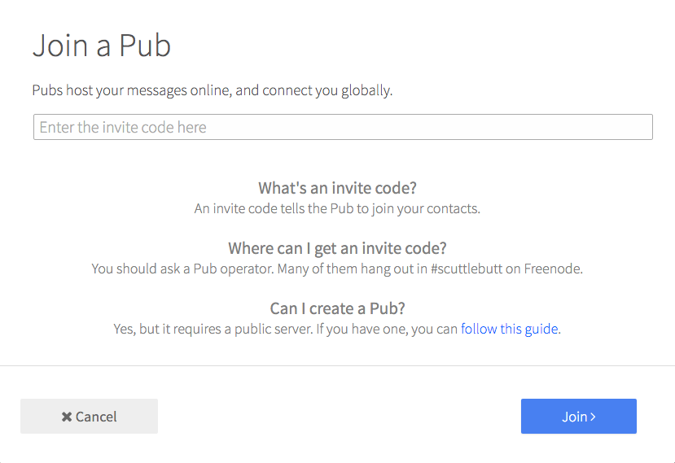

# Form: Pub Invite

Modal form for using Pub-server invites



```jsx
import ModalBtn from 'patchkit-modal/btn'
import FormPubInvite from 'patchkit-form-profile-name'

<ModalBtn Form={FormPubInvite} nextLabel="Join"><a className="btn"><i className="fa fa-cloud"/> Join Pub</a></ModalBtn>
```